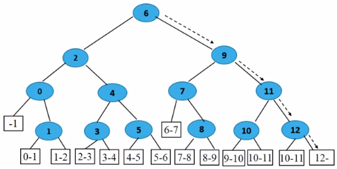
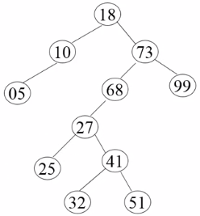
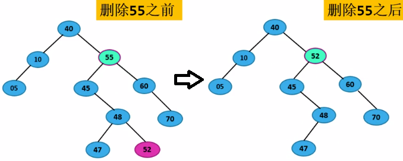
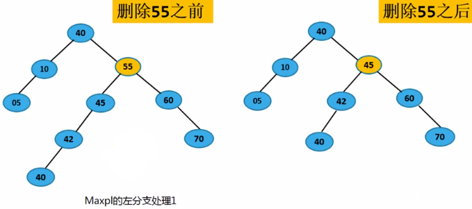
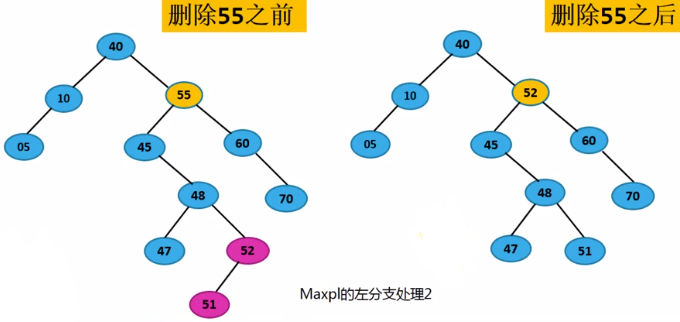
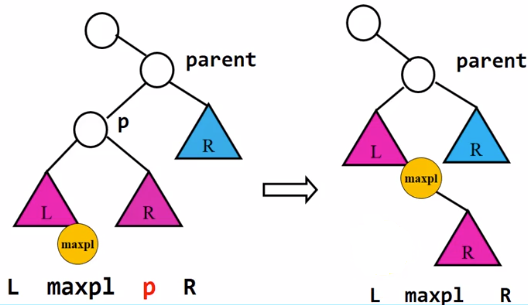
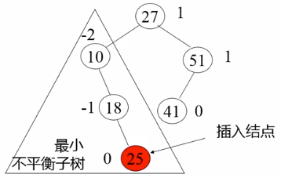
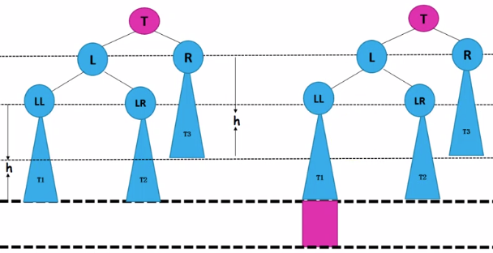
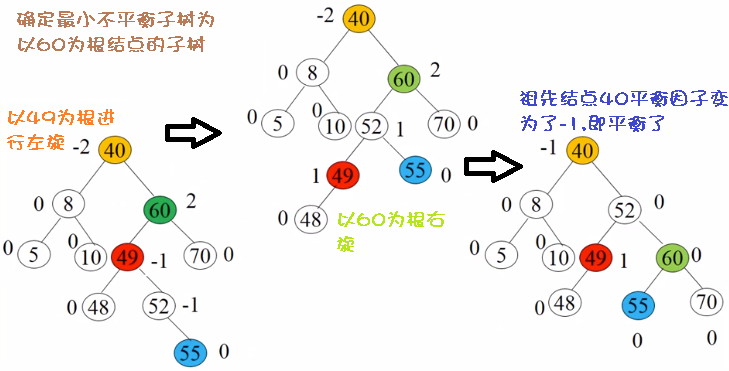
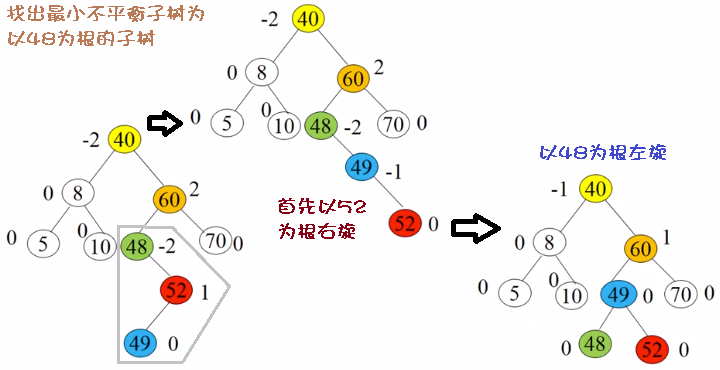

搜索树
========
[关键词]动静观和平衡术

有序表---动态调整效率低
二叉排序树---单分支的最坏情况
AVL树(平衡二叉排序树)---近似平衡
红黑树---大致平衡(引入颜色)

检索效率:平均检索长度(ASL Average Search Length)
=========
&emsp;&emsp;查找或搜索是指从一组数据元素中找到需要的数据元素.衡量查找效率的主要标准是查找过程中平均比较次数,即平均检索长度ASL,定义:<br>
<br>
&emsp;其中,n是结点的个数,p<sub>i</sub>是查找第i个结点的概率,若不特别声明,一般认为每个结点的查找概率是相等的,即p<sub>1</sub>=p<sub>2</sub>=...=p<sub>n</sub>=1/n<br>
&emsp;c<sub>i</sub>是查找到第i个结点成功,所需要比较的次数<br>
&emsp;uc<sub>i</sub>是查找到第i个结点失败,所需要比较的次数<br>
<br>
<br>

[示例]用二分检索算法求ASL(二分查找是下取整的)<br>
序列:5&nbsp;13&nbsp;19&nbsp;21&nbsp;37&nbsp;56&nbsp;64&nbsp;75&nbsp;80&nbsp;88&nbsp;92<br>

比较一次就成功的1个;(即56)<br>
比较两次就成功的2个;(即19和80,要先和56比)<br>
比较三次就成功的4个;(即5,21,64,88)<br>
比较四次就成功的4个;(即13,37,75,92)<br>

ASL<sub>二分</sub>=(1*1+2*2+3*4+4*4)/11=3<br>

[讨论]二分查找的效率(ASL)<br>
[推导过程]<br>
1次比较就查找成功的元素有1个<font color=blue>(2<sup>0</sup>)</font>,即中间值;<br>
2次比较就查找成功的元素有2个<font color=blue>(2<sup>1</sup>)</font>,即1/4处(或3/4处);<br>
3次比较就查找成功的元素有4个<font color=blue>(2<sup>2</sup>)</font>,即1/8处(或3/8处,或...);<br>
... ... 以此类推 ... ...<br>
则第j次比较时查找成功的元素会有<font color=blue>(2<sup>j-1</sup>)</font>个.<br>
<font color=orange>为方便起见,假设表中全部n个元素=2<sup>j-1</sup>个</font>,此时就不讨论第j次比较之后还有剩余元素的情况了.<br>
则根据定义,全部比较总次数为:<br>
<br>
乘以概率,得到ASL,即:<br>
<br>

>这就说明,二分检索的效率为log(n),比之前检索的效率要好<br>

二分查找判定树
=========
对**有序表**(5,10,<font color=pink>25</font>,27,30,35,<font color=brown>45</font>,49,50,<font color=pink>52</font>,55,60,70)进行**二分查找**,第1次比较查找成功的元素作为二叉树的根,第2次比较查找成功的元素是前半区间和后半区间中间的元素,作为根的左右子树,以此类推,由此得到的二叉树称为<font color=red>二分查找判定树</font>.<br>

<br>

* <font color=purple>查找成功</font>是查找二分查找判定树中已有的结点,比较从判定树的根结点开始,走了一条从根结点到该结点的路径.路径上通过的结点个数即为查找比较的次数<br>
* <font color=orange>查找失败</font>的过程走了一条从根结点到其扩充二叉树的外部结点的路径<br>
>对长度为13的任意有序表进行二分查找,得到的二分查找判定树形态是相同的<br>

[继续研究长度为13的二分查找判定树]<br>
* 查找成功时进行比较的次数最多不超过该树的深度.而具有n个结点的判定树的深度为<font color=red>└log<sub>2</sub>n┘</font><br>
* 所以二分查找法在查找成功时的比较次数最多为<font color=red>└log<sub>2</sub>n┘+1</font><br>
* 如果考虑到查找不成功的情况,则判定树如下所示(方框表示查找不成功的情况):<br>

<br>
>0-1表示介于下标为0和1之间的数,-1表示比下标为1的数小的数<br>

* 由此可见,查找不成功时的最多比较次数也是<font color=red>└log<sub>2</sub>n┘+1</font><br>
>即检索效率也算log(n)<br>

二叉排序树(Binary Sort Tree--<font color=red>BST</font>)
===========
二叉排序树也称为二叉搜索树,<br>
它可以是一棵空二叉树,<br>
或者是具有下列性质的二叉树:<br>
1. 若它的左子树不为空,则<font color=red>左子树</font>上所有结点的值均<font color=red>小于</font>它的根结点的值<br>
2. 若它的右子树不为空,则<font color=red>右子树</font>上所有结点的值均<font color=red>大于</font>它的根结点的值<br>
3. 它的<font color=blue>左右子树</font>也分别为<font color=blue>二叉排序树</font><br>

二叉排序树的特点
-----------
* 二叉搜索树都满足根结点左子树比根结点小,右子树比根结点大<br>
* 二叉搜索树的对称遍历可以得到一个有序序列<br>
* 二叉搜索树的查找过程可以用二分检索完成<br>
* 二叉搜索树的插入都是作为叶子结点插入的<br>
* 删除的过程不需要移动结点,只需要改变结点之间的逻辑关系<br>
>接口:查找Search&nbsp;插入Insert&nbsp;删除Delete<br>

二叉排序树的查找(检索)过程
-----------
以类似于思想过程的方式给出伪代码:<br>

```BST--Search伪
while(T 非空)
    {
        if (T.key == key)
            查到;
        else 
            if (T.key > key)
                查左子树
            else
                查右子树
    }
```

二叉排序树的类型定义
----------
定义和之前的二叉树定义相同,只不过是改了改名字而已:<br>
```c
typedef int DataType;
typedef struct BinSearchTreeNode
{
    DataType data;
    struct BinSearchTreeNode *leftchild;
    struct BinSearchTreeNode *rightchild;
}BSTreeNode;
typedef BSTreeNode *BinSearchTree;
```

实际的项目代码中是这样定义的<br>
```c
typedef int DataType;
//二叉排序树节点定义
struct BinSearchTreeNode
{
	DataType data;
	struct BinSearchTreeNode *leftchild;
	struct BinSearchTreeNode *rightchild;
};
typedef struct BinSearchTreeNode *BSTreeNode;
typedef struct BinSearchTreeNode *BinSearchTree;
```

二叉排序树的检索算法
---------
```c
//传入二叉树的根bt和要查找的k
BSTreeNode BSTSearch(BinSearchTree bt,DataType key)
{
    BSTreeNode p,parent;
    p = bt;
    parent = p; //记录待插入结点的父结点
    while(p)
    {
        parent = p;
        //当查找到时提示,返回NULL
        if(p->data == key)
        {
            printf("Exist this key\n");
            return NULL;
        }
        //根结点大于要查的结点,进入左分支查找
        if(p->data > key)
        {
            p = p->leftchild;
        }
        //根结点小于要查的结点,进入右分支查找
        else
        {
            p = p->rightchild;
        }
    }//p=NULL,跳出循环
    return parent;  //查找失败,返回parent
}//return NULL和parent是为了便于之后的操作
```
[注]<br>
二叉排序树检索的算法最坏情况为O(n),即进行一次检索<br>
解决的方式是让树根结点两侧的子树的深度之差越小越好,即平衡二叉排序树<br>

二叉排序树的插入算法
------------
[思路伪代码]<br>
```(伪)BST--Insert
if(二叉排序树中查不到该结点)
{
    建立新结点;
    if(原二叉排序树为空)
        新结点作为根结点插入;
    else 
        if(新结点<父结点)
            插入左子树;
        else
            插入右子树;
}
```

具体算法实现如下:<br>

```c
//二叉排序树插入过程
int BSTInsert(BinSearchTree bt,DataType key)
{
    BSTreeNode p,temp;
    temp = BSTSearch(bt,key);   //temp保存查找之后的结果
    //已存在,返回0
    if(temp == NULL)
    {
        printf("Exist this key\n");
        return 0;
    }
    //申请结点的内存空间
    p = (BSTreeNode *)malloc(sizeof(struct BinSearchTreeNode));
    //申请失败提示
    if(p == NULL)
    {
        printf("Alloc Failure!\n");
        return 0;
    }
    p->data = key;  //数据域赋值,左右指针域默认为空
    //p->leftchild = NULL;  //左子树指针域赋值
    //p->rightchild = NULL; //右子树指针域赋值
    if(key < temp->data)
    {
        temp->leftchild = p;    //作为左子树插入
    }
    else
    {
        temp->rightchild = p;   //作为右子树插入
    }
    return 1;
}//时间复杂度O(n)
```

>有了插入算法,就可以从一棵空树开始,建立一棵二叉排序树了

若从空树出发,经过一系列插入操作后,可以生成一棵二叉排序树.<br>
例如,K={18,73,10,05,68,99,27,41,51,32,25}建立的二叉排序树为:<br>

<br>

二叉排序树的删除
----------
假如要删除结点p,分两种情况:<br>
1.p没有左子树只有右子树<br>
2.p既有左子树也有右子树<br>
[要求]删除二叉排序树的某个指定结点后,仍然要是二叉排序树<br>
<br>
①若p左子树为空,此时,只要令p的右子树的根结点代替p即可<br>
假设指针p指向要删除的结点,那么parentp指向p的父结点<br>
<br>
②若p既有左子树又有右子树,对其操作有两种方法:<br>
**[方法1]**<br>
(a)按对称序周游p的左子树,找到关键码最大的结点maxpl,删除maxpl结点<br>
(b)用maxpl结点代替被删除的结点p<br>

<br>

[如果maxpl有左分支]<br>
有两种情况,一种是maxpl自己有左分支且maxpl与p不相连,一种是maxpl有左分支与p相连<br>

<br>
<br>

第一种删除算法的具体实现
-------------
```c
//第一种删除算法
//删除与key相同的结点
int BSTDelete1(BinSearchTree *bt,DataType key)
{
    BSTreeNode parent, p, maxpl;
    p = *bt;
    parent = NULL;
    //查找被删除的结点
    while(p != NULL)
    {
        if(p->data == key)
            break;  //查找到了,跳出循环
        parent = p; //注意这一句
        if(p->data > key)
            p = p->leftchild;
        else
            p = p->rightchild;
    }//查询结束
    if(p == NULL)
    {
        printf("%d not exist\n",key);
        return 0;
    }
    //只有右子树的情况
    if(p->leftchild == NULL)
    {
        //如果被删除的结点是根结点,那就要修改的是二叉排序树的根
        if(parent == NULL)
            *bt = p->rightchild;
        //检查是左孩子还是右孩子
        else if(parent->leftchild == p)
            parent->leftchild = p->rightchild;
        else
            parent->rightchild = p->rightchild;
    }
    //既有左子树也有右子树
    if(p->leftchild != NULL)
    {
        BSTreeNode parentp; //parentp记录maxpl的父结点
        parentp = p;
        maxpl = p->leftchild;
        //对称遍历中,右侧的总是大的数
        //定位p的左子树中的最大结点maxpl
        while(maxpl->rightchild != NULL)
        {
            parentp = maxpl;
            maxpl = maxpl->rightchild;
        }
        p->data = maxpl->data;  //修改p的数据域为maxpl的值
        if(parentp == p)    //如果maxpl的父结点是p
            p->leftchild = maxpl->leftchild;    //修改p结点的左指针
        else
            parentp->rightchild = maxpl->leftchild; //修改父结点的右指针
        p = maxpl;  //更新p指针为maxpl结点以便删除
    }
    //释放空间
    free(p);
    return 1;
}//时间复杂度O(n)
```

**[方法2]**<br>
首先找到p的左分支的最大值maxpl<br>
令p的左子树的根结点代替p,p的右子树变为maxpl的右子树<br>
像这样:<br>
<br>

删除时结点的情况类似于方法1,基本的删除过程像这样:<br>
<br>

```c
//第二种删除算法
//删除与key相同的结点
int BSTDelete2(BinSearchTree *bt,DataType key)
{
    //parent记录p的父结点,maxpl记录p的左子树中的关键码最大结点
    BSTreeNode parent, p, maxpl;
    p = *bt;
    parent = NULL;
    //查找被删除的结点
    while(p != NULL)
    {
        if(p->data == key)
            break;  //查找到了,跳出循环
        parent = p; //注意这一句
        if(p->data > key)
            p = p->leftchild;
        else
            p = p->rightchild;
    }//查找结束
    if(p == NULL)
    {
        printf("%d not exist!\n",key);
        return 0;
    }
    //只有右子树的情况
    if(p->leftchild == NULL)
    {
        //删除的是根结点,做特殊处理
        if(parent == NULL)
            *bt = p->rightchild;
        //p是父结点parent的左孩子,则修改父结点的左指针
        else if(parent->leftchild == p)
            parent->leftchild = p->rightchild;
        else
            parent->rightchild = p->rightchild;
    }
    //以上和方法1几乎完全相同

    //有左子树和右子树
    if(p->leftchild != NULL)
    {
        maxpl = p->leftchild;
        //定位左子树中的最大结点maxpl
        while(maxpl->rightchild != NULL)
            maxpl = maxpl->rightchild;
        maxpl->rightchild = p->rightchild;
        if(parent == NULL)
            *bt = p->leftchild;
        //p是父结点parent的左孩子,则修改父结点的左指针
        else if(parent->leftchild == p)
            parent->leftchild = p->leftchild;
        //p是父结点parent的右孩子,则修改父结点的右指针
        else
            parent->rightchild = p->leftchild;
    }
    free(p);    //释放结点p
    return 1;
}//时间复杂度O(n)
```
>具体项目参照BinTree_BSTree

BST算法分析
---------
最好情况:完全二叉树--时间复杂度O(logn)<br>
最坏情况:单支树--时间复杂度O(n)<br>
<br>
折中办法:相对平衡BST--构造AVL树或构造RB树<br>

平衡二叉排序树(AVL树)的概念
---------
它可以是一棵空树,或者是具有下列性质的二叉排序树:<font color=red>它的左右子树均为平衡二叉排序树,且左右子树的深度之差的绝对值不超过1</font>,即超过1就不是一棵平衡二叉排序树<br>
结点的<font color=blue>平衡因子BF</font>:<font color=green>结点的左子树深度-右子树深度</font><br>
>有的是右子树深度-左子树深度,性质其实是一样的

最小不平衡子树:<br>
* 离插入结点最近,且以平衡因子绝对值大于1的结点为根的子树<br>
<br>

我们的任务,就是将这种最小不平衡子树调整为平衡的<br>
方式有四种:<br>
* LL型调整<br>
* RR型调整<br>
* LR型调整<br>
* RL型调整<br>

AVL--LL型调整
--------
下图这样一棵平衡二叉树,其平衡因子为1,当给T的左孩子的左子树添加一个结点(LL),使其平衡因子变为2,这样就不是平衡二叉树了,现在,整个以T为根的树为最小不平衡子树<br>
<br>
那么如何调整为平衡呢?---以T为结点,右旋<br>
<br>

下面这个图可以简单地说明上述问题:<br>
<br>
>调整最小不平衡子树,其祖先的不平衡也就会转变为平衡了<br>

AVL--RR型调整
---------
同LL型调整类似,这种情况就是当给T的右孩子的右子树添加一个结点(RR),调整方式即以T为结点,左旋<br>
<br>

AVL--LR型调整
---------
这种类型的不平衡需要进行左旋+右旋的方式才能调整好,这种情况的发生是因为给T的左分支的右子树添加结点(LR)引起了不平衡,如图,首先要以T的左孩子L为根左旋,此时变为了T结点的左孩子的左子树导致不平衡(即LL型),再以T为根右旋一次即可<br>
<br>
例如下面这两个例子:<br>
第一个例子,调整之后,10的祖先没有收到影响,也是平衡的<br>
<br>

第二个例子,调整之后,祖先结点40原本不平衡的因子变为了平衡的因子<br>
<br>

AVL--RL型调整
--------
同LR的旋转方式刚刚好是反着的,这种情况的发生是因为给T的右分支的左子树添加了结点(RL)引起了不平衡,首先找到最小不平衡子树,以其根结点的右孩子为根进行右旋,再以最小不平衡字数的根结点为根进行左旋即可<br>
比如下面这个例子:<br>
<br>